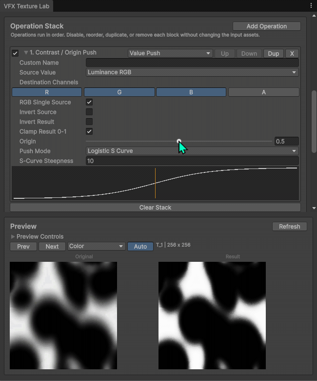
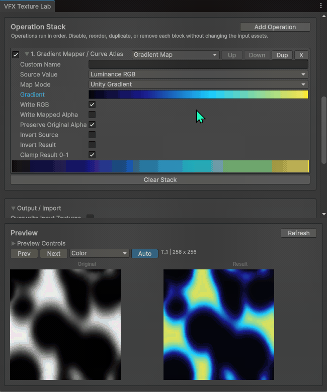

# VFX Texture Lab


A free and open-source Unity 6+ editor tool for VFX artists to batch-edit textures without leaving Unity.

Use it for fast mask cleanup, contrast pushing, gradient mapping, channel packing, thresholding, blur, posterize, dilation, erosion, and other common VFX texture tasks.

Made by [PudinKiller](https://github.com/PudinKiller).

---

## Why this exists

VFX artists often need small texture edits while working inside Unity: pushing mask contrast, remapping grayscale textures into colorful ramps, packing channels, cleaning thresholds, or expanding and shrinking masks.

Opening Substance Designer, Photoshop, or another DCC tool can slow down iteration, especially when dealing with many small VFX textures.

**VFX Texture Lab is not trying to replace Substance Designer.**  
It is a lightweight Unity editor utility for the quick edits that happen all the time during VFX production.

---

## Feature Demos

<table>
  <tr>
    <td width="50%">
      
      <br>
      <sub><b>Contrast / Origin Push</b><br>Push grayscale masks around an adjustable origin using artist-friendly curves.</sub>
    </td>
    <td width="50%">
      
      <br>
      <sub><b>Gradient Mapper</b><br>Turn grayscale textures into colorful VFX ramps using gradients or curves.</sub>
    </td>
  </tr>
</table>

<details>
<summary><b>Full workflow demo</b></summary>

<br>


</details>

---

## Core Features

| Feature | What it is useful for |
|---|---|
| Batch processing | Process many VFX textures with the same operation stack |
| Always-visible preview | Compare original and result while editing |
| Contrast / Origin Push | Art-direct mask contrast around a chosen origin |
| Gradient Mapper | Convert grayscale textures into colorful VFX ramps |
| Channel Pack | Copy grayscale data into R, G, B, or A channels |
| Threshold / Posterize | Create hard masks, stylized bands, and cutoffs |
| Blur / Dilate / Erode | Soften, expand, or shrink mask shapes |
| Data Linear / Color sRGB | Choose correct output color space for data or color textures |
| PNG / EXR output | Use simple 8-bit output or high precision output |

---

## Installation

### Option 1: Install from Git URL

This method requires Git to be installed on your computer.

In Unity:

1. Open `Window > Package Manager`
2. Click the `+` button
3. Choose `Add package from git URL`
4. Paste:

```text
https://github.com/PudinKiller/VFXTextureLab.git
```

To install a specific version:

```text
https://github.com/PudinKiller/VFXTextureLab.git#v0.1.1
```

<details>
<summary><b>Install without Git</b></summary>

### Option 2: Install using ZIP

Use this method if Unity says Git is not installed.

1. Open the GitHub Releases page.
2. Download `Source code (zip)`.
3. Unzip it somewhere on your computer.
4. In Unity, open `Window > Package Manager`.
5. Click the `+` button.
6. Choose `Add package from disk`.
7. Select the unzipped package's `package.json`.

### Option 3: Install using `.tgz`

If a `.tgz` package is provided in Releases:

1. Download the `.tgz` file.
2. In Unity, open `Window > Package Manager`.
3. Click the `+` button.
4. Choose `Install package from tarball`.
5. Select the downloaded `.tgz` file.

</details>

---

## Quick Start

Open the tool from:

```text
Tools > Pudin Killer > VFX Texture Lab
```

Basic workflow:

1. Drag one or more textures into the input list.
2. Click `Add Operation`.
3. Add operations such as `Contrast`, `Gradient Mapper`, `Threshold`, or `Channel Pack`.
4. Check the original/result preview.
5. Choose output settings.
6. Click `Process All Textures`.

> [!TIP]
> For most grayscale masks, noise textures, dissolve maps, flow maps, and packed channels, use `Content Type: Data Linear`.

---

## Common Workflows

<details open>
<summary><b>Clean up a grayscale mask</b></summary>

Recommended stack:

```text
Levels -> Contrast -> Threshold
```

Recommended output settings:

```text
Content Type: Data Linear
Generate Mip Maps: Off
Force Uncompressed: On
```

Good for dissolve masks, smoke masks, impact masks, stylized noise masks, and other grayscale VFX data textures.

</details>

<details>
<summary><b>Push mask contrast</b></summary>

Recommended operation:

```text
Contrast / Origin Push
```

Useful settings:

```text
Source Value: LuminanceRGB
RGB Single Source: On
Origin: Adjust depending on the mask
Push Mode: Smoothstep, Smootherstep, or LogisticSCurve
```

`Origin` is the main artistic control. Move it to decide which value range gets pushed toward dark or bright.

</details>

<details>
<summary><b>Turn grayscale into a vibrant VFX texture</b></summary>

Recommended stack:

```text
Contrast -> Gradient Mapper
```

Recommended Gradient Mapper settings:

```text
Source Value: LuminanceRGB
Map Mode: Unity Gradient or HSV Curves
Write RGB: On
Preserve Original Alpha: On
```

Use `Unity Gradient` for quick hand-authored color ramps.

Use `HSV Curves` when you want hue, saturation, and brightness to vary independently across the grayscale input.

</details>

<details>
<summary><b>Make alpha from grayscale</b></summary>

Recommended operation:

```text
Channel Pack
```

Settings:

```text
Source Value: LuminanceRGB
Destination Channels: A only
```

This is useful when you have a grayscale image and want to turn it into an alpha mask.

</details>

<details>
<summary><b>Edit packed RGB masks</b></summary>

For packed mask textures where R, G, B, and A store different data, turn off:

```text
RGB Single Source
```

Then enable only the channel you want to modify.

Example:

```text
Edit only Red channel
Keep Green, Blue, and Alpha untouched
```

</details>

---

## Recommended Output Settings

| Texture type | Recommended content type | Notes |
|---|---|---|
| Mask | Data Linear | Values should not be color corrected |
| Noise | Data Linear | Best for dissolve, distortion, erosion, and procedural masks |
| Packed R/G/B/A | Data Linear | Each channel stores data |
| Flow / height / utility maps | Data Linear | Treat as data, not visible color |
| Final colorful texture | Color sRGB | Use when sampled as visible color |
| High precision texture | EXR + Data Linear | Helps avoid 8-bit banding |

> [!WARNING]
> Overwrite mode is destructive. Use version control or duplicate important textures first.

<details>
<summary><b>PNG vs EXR</b></summary>

Use PNG when:

```text
You want small, simple 8-bit textures
You are working with normal masks or preview textures
You do not need HDR or high precision
```

Use EXR when:

```text
You need high precision
You want to avoid gradient banding
You need HDR-style values
You are storing data that should not be quantized to 8-bit
```

</details>

---

## Operation Reference

<details>
<summary><b>Show operation descriptions</b></summary>

### Contrast / Origin Push

Pushes texture values around an origin point using a curve.

Useful for mask contrast, dissolve shapes, smoke density, magic effects, stylized ramps, and texture cleanup.

### Gradient Mapper

Maps grayscale input into color.

Modes:

- `Unity Gradient`: easiest mode for hand-authored color ramps
- `RGBA Curves`: red, green, blue, and alpha curves over grayscale input
- `HSV Curves`: hue, saturation, value, and alpha curves over grayscale input

`HSV Curves` are especially useful for colorful VFX because hue, saturation, and brightness can be controlled separately.

### Invert / Revert Color

Inverts selected channels.

Useful for reversing masks or flipping black/white texture data.

### Levels / Remap

Remaps input range, gamma, and output range.

Useful for normalizing masks, increasing contrast, or correcting weak grayscale textures.

### Threshold / Mask Clean

Converts soft grayscale values into hard or feathered masks.

Useful for dissolve masks, stylized cutoffs, and binary mask cleanup.

### Posterize / Bands

Converts smooth values into discrete steps.

Useful for stylized VFX, toon effects, stepped gradients, and banded masks.

### Colorize / Tint

Applies a simple tint based on source intensity.

For more advanced color variation, use `Gradient Mapper`.

### Channel Pack

Copies a source value into selected destination channels.

Useful for packing grayscale masks into R, G, B, or A channels.

### Auto Normalize

Scans selected channels and remaps their actual minimum and maximum values to `0-1`.

Useful when a mask looks too flat or does not use the full value range.

### Blur

Applies a simple blur to selected channels.

Useful for softening masks.

### Dilate / Expand Mask

Expands bright areas of a mask.

Useful for growing alpha masks, expanding impact shapes, and fixing thin mask edges.

### Erode / Shrink Mask

Shrinks bright areas of a mask.

Useful for tightening masks, removing small bright noise, and cleaning edges.

</details>

---

## Troubleshooting

<details open>
<summary><b>My grayscale texture gets purple or green artifacts</b></summary>

Enable:

```text
RGB Single Source
```

This uses one grayscale source value for RGB instead of processing R, G, and B separately.

This matters because many grayscale textures are not perfectly identical across RGB channels after import, compression, filtering, or color-space conversion. Nonlinear operations can exaggerate tiny channel differences into visible color artifacts.

For packed RGB masks, disable `RGB Single Source`.

</details>

<details>
<summary><b>Unity says Git is not installed</b></summary>

The Git URL install method requires Git.

Use the ZIP or `.tgz` installation method instead.

</details>

<details>
<summary><b>The output looks blurry or shifted</b></summary>

Try these settings:

```text
Content Type: Data Linear
Generate Mip Maps: Off
Force Uncompressed: On
Filter Mode: Point or Bilinear
```

For final visible color textures, use `Color sRGB`.

For masks and data textures, use `Data Linear`.

</details>

---

## Limitations

- Processing is CPU-based, so very large textures or big batches can be slow.
- PNG output is 8-bit and can show banding in smooth gradients.
- Use EXR for high precision or HDR-style data.
- Overwrite mode is destructive. Use version control or duplicate important textures first.
- The curve editor is designed for quick editing. Unity's built-in curve fields are still available for more precise curve editing.

---

## Roadmap

Possible future improvements:

- More example presets
- Backup option for overwrite mode
- Better curve editor controls
- Compute-shader acceleration for large textures
- Import/export operation stacks
- More VFX-specific filters
- Optional preview histogram
- Better documentation with example textures

---

## Contributing

Bug reports, feature ideas, and workflow suggestions are welcome.

When reporting an issue, please include:

- Unity version
- Operating system
- Tool version
- Texture format
- Texture import settings
- Steps to reproduce the issue
- Screenshots or GIFs if possible

---

## Development

This repository is structured as a Unity Package Manager package.

Expected package layout:

```text
VFXTextureLab/
  package.json
  README.md
  CHANGELOG.md
  LICENSE.md
  Editor/
    PudinKiller.VFXTextureLab.Editor.asmdef
    VFXTextureLab.cs
  Documentation~/
  Samples~/
  .github/
    readme/
      Contrast.gif
      GradientMapping.gif
      Workflow.gif
```

To test locally, add the package to a Unity project using:

```text
Window > Package Manager > + > Add package from disk
```

Then select this repository's `package.json`.

---

## License

MIT License.

You can use this tool in personal, educational, and commercial projects.
